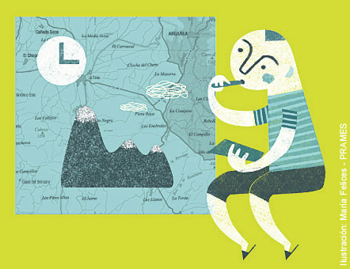

# Planificar la actividad (1 de 30)  

**Planificar una actividad** es siempre una acción PREVIA a su realización, y marcará en gran medida el éxito de la misma.

Para planificar correctamente una actividad será necesario:

**1\. Seleccionar **una ruta adecuada

**2**. Hacer **cálculos de distancias, desniveles y horarios**

**3\.** Consultar la **meteorología**

**4\.** Prever **alternativas**

**5\.** **Contar **adónde vamos

