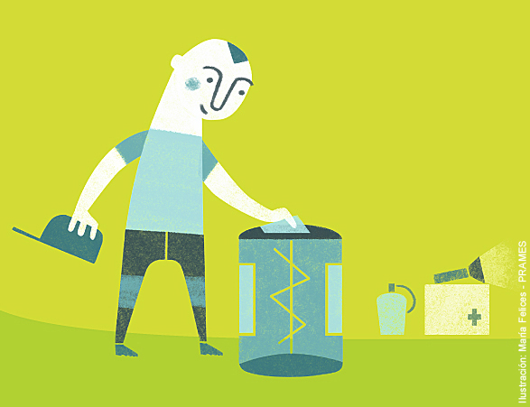

# Equiparse correctamente (12 de 30)

Si el senderista lleva consigo todo lo necesario su excursión será más segura y placentera. Hacer una lista de lo necesario y comprobar antes de partir que todo el grupo lleva lo necesario resulta clave para aportar seguridad a nuestras actividades.

En la mochila de un senderista nunca debe faltar:

1.  **Ropa** que proteja del frío, el agua y el viento
2.  **Calzado** apropiado
3.  **Agua y comida** suficientes
4.  **Protección solar**: crema, gafas de sol, gorra
5.  **Botiquín** de primeros auxilios y **manta térmica**  
    
6.  Medios **para orientarse**: mapa, brújula, linterna, GPS
7.  Medios **para comunicarse**: móvil y cargador adicional, silbato, chaleco reflectante

