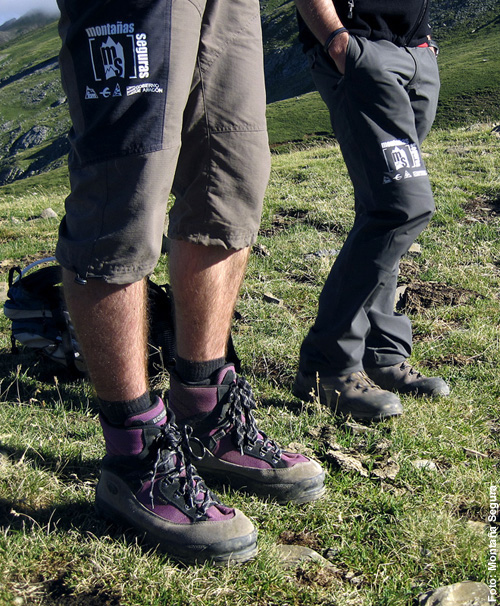

# Equiparse: Calzado (14 de 30)

Con un calzado apropiado se camina más cómodo y con menor esfuerzo, a la vez que se pueden evitar pequeñas pero muy molestas lesiones (rozaduras, ampollas) y prever otras más importantes (tendinitis, esguinces, fracturas).

Para caminar en montaña o caminos **no sirve el mismo calzado que se usa todos los días**: es algo que se olvida con demasiada frecuencia. Por ello hay que tener en cuenta:  

1\. El **tipo de suelo** (firme) sobre el que discurre la excursión y su estado (piedras, barro...)  
2\. La **longitud** y los **desniveles** del itinerario  
3\. La **climatología** prevista, en particular el frío y la lluvia  
4\. La **adaptación del pie** al calzado: evitando que sea nuevo o esté en mal estado

Y de acuerdo con lo anterior, conviene valorar estos aspectos del calzado: 

*   el tipo de **suela** (dureza, amortiguación, agarre)
*   la **protección del tobillo** que ofrece  
    
*   el **aislamiento** térmico
*   la **transpiración** y/o **impermeabilidad**
*   la protección **frontal y lateral** del pie

Es recomendable también elegir unos **calcetines** apropiados y llevar un recambio que permita mantener secos los pies.  

Como **federados**, debemos escoger el calzado adecuado para cada actividad, sin que ello signifique que necesitemos un calzado muy técnico o caro.  

