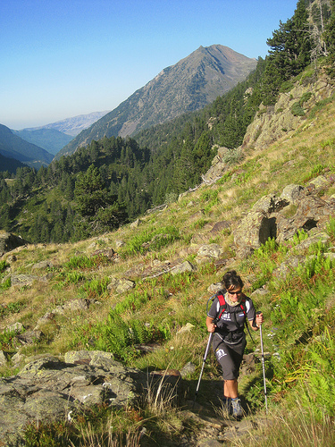

# Equipa: Bastones (15 de 30)

No son imprescindibles para practicar senderismo, pero su uso tiene **ventajas** que debemos conocer:

1\. **Reducen la carga sobre la espalda y sobre articulaciones** como los tobillos, rodillas y cadera  
2\. **Aumentan los puntos de apoyo proporcionando mayor estabilidad**, sobre todo en pendientes y superficies deslizantes  
3\. **Hacen trabajar a un gran número de músculos del cuerpo**, mejorando la capacidad cardiovascular y la oxigenación

La **longitud** ideal del bastón para un desarrollo natural del movimiento es 2/3 de la estatura del usuario.

