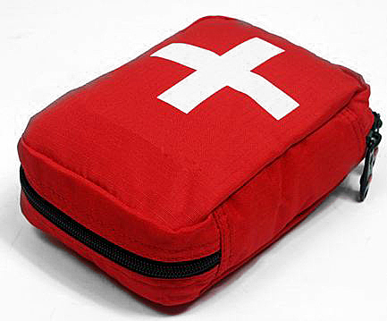

# Equipa: El botiquín (18 de 30)

Un botiquín de campaña pesa y ocupa poco pero puede ser de gran utilidad. Permite afrontar contratiempos bastante habituales como:

\- Erosiones y cortes  
\- Rozaduras del calzado o la mochila  
\- Picaduras de insectos y reacciones alérgicas  
\- Pequeños golpes, torceduras...

Llevar un botiquín no servirá para salvarle la vida a alguien, a no ser que quien lo lleve sea médico, pero puede ayudar a pasar en mejores condiciones pequeñas lesiones o molestias que pueden arruinar una excursión.

Para solventar problemas mayores, sería deseable que todos tuviéramos conocimientos básicos de **primeros auxilios.**

Resulta necesario:  
1\. Llevar siempre los **prospectos de todos los medicamentos** o un resumen de sus indicaciones y dosis  
2\. Renovar periódicamente los medicamentos y **revisar las fechas de caducidad**  
3\. Recordar que el botiquín es para el uso personal de cada uno, pues **sólo un médico puede prescribir un medicamento**

Para la confección de un botiquín recomendamos **incluir**:

*   Analgésico, para el dolor en general y para bajar la fiebre: paracetamol  
    
*   También un analgésico más fuerte para dolores más intensos (muelas, apendicitis, fracturas…): comometamizol
*   Para la diarrea: loperamida
*   Para la tos: codeína
*   Para reacciones alérgicas leves: dexclofeniramina
*   Para las nauseas y vómitos: metoclopramida
*   Algún antiácido para el ardor o dolor de estómago
*   Colirio para calmar y limpiar los ojos de afecciones por el sol, el viento...

Para la limpieza de heridas:

*   un tubo de 10 ml de suero fisiológico
*   Povidona yodada como solución antiséptica
*   dos vendas compresivas elásticas de 5 cm
*   esparadrapo
*   gasas estériles
*   una gasa engrasada para poner en una herida antes de taparla
*   tiras de aproximación
*   tiritas
*   una pinza pequeña
*   unas hojas de bisturí
*   tijeras
*   agujas estériles

Para prevenir otros problemas:

*   pastillas de glucosa (agotamientos)
*   sales minerales (deshidrataciones)
*   algún alimento energético (cansancios extremos)
*   pastillas para potabilizar el agua
*   una manta térmica (para abrigar a heridos)
*   guantes estériles
*   crema solar de protección total (para quemaduras)

Como **federados**, no olvides incluir siempre un botinquín en tu mochila, por lo menos uno por grupo.  

