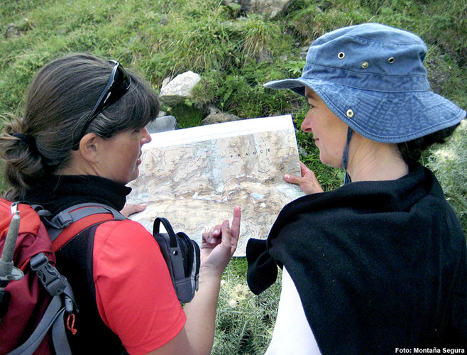

# Equipar: Para orientarse (19 de 30)

Para garantizar la autonomía en un recorrido orientándose correctamente, resulta necesario llevar:

**1\. Cartografía** de la zona, mejor cuanto más actualizada y **detallada** (escala 1:40.000, 1:25.000...)  
**2\. Brújula**, permite orientarse en cualquier lugar y situación  
**3\. GPS,** si se dispone de él y se sabe usar será **un complemento** muy útil, que no evitará el que debamos llevar igualmente mapa y brújula  

Sin embargo, **todos los sistemas de orientación no servirán de nada si no sabemos leerlos e interpretarlos correctamente.**  

Hay que dedicar tiempo a familiarizarse con la interpretación de los **mapas**, el uso de la **brújula** y del **GPS**. El mapa es una herramienta fundamental para el senderista.

Nunca debe olvidarse que como todo aparato electrónico, **el GPS es vulnerable y puede fallar por un golpe, el estado de las baterías o los caprichos de la tecnología**, que siempre falla cuando más se la necesita...  

**Nuestra responsabilidad llevar siempre mapa y sacarlo durante el recorrido tantas veces como sea necesario**, de esa manera ayudamos a que el resto del grupo o la gente menos experta se vayan familiarizando con él y aprendan a leerlo.  

