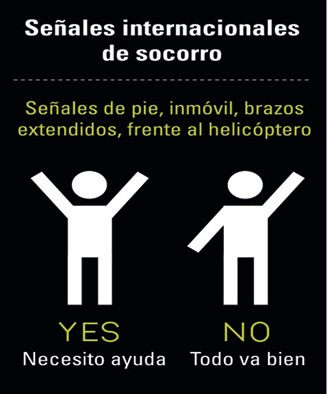

# Equipa: Para comunicarse (20 de 30)

Cuando ocurra una emergencia, estar comunicado puede resultar vital.

Por ello, en todas las salidas senderistas es imprescindible llevar teléfono móvil y contactar de inmediato con el **112**.

Será de gran ayuda:  

1\. Llevar el **móvil** completamente **cargado** y **apagado** durante la actividad para no consumir la batería. Encenderlo de vez en cuando para comprobar la cobertura.  
2\. Saber que el número de emergencias **112** es válido en toda la Unión Europea pero no es un número mágico: se necesita **cobertura** (de cualquier compañía, nacional o europea) para poder contactar, por lo que hay que saber siempre dónde está el punto más cercano donde la haya  
3\. Un **silbato** para ayudar a nuestra localización  
4\. Un **chaleco** reflectante para hacernos más visibles  
5\. Una **linterna** o **frontal** para ver y hacernos ver   
6\. Conocer el código internacional de **señales de socorro** para comunicarnos a distancia (en la imagen)  

**El teléfono móvil suele ser algo que todos los excursionistas llevan en el bolsillo,** a veces de forma premeditada a veces porque se les olvida dejarlo en el coche, pero incluso en aquéllos parajes donde se "crea" que no hay cobertura conviene llevarlo por si acaso.  

