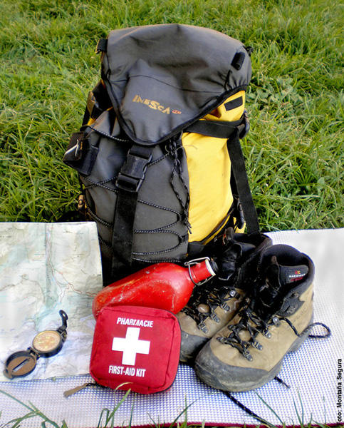

# Equipa: Todo a la mochila (21 de 30)

Esta puede ser una **lista general** de las cosas que sería bueno y prudente llevar SIEMPRE en la mochila. Muchas de ellas no se utilizarán nunca o casi nunca (mejor así!), pero deben llevarse por si acaso y tampoco pesan mucho.  

1\. Ropa de abrigo y cortavientos  
2\. Impermeable  
3\. Calzado adecuado y calcetines de repuesto  
4\. Cantimplora o botella de agua  
5\. Comida suficiente  
6\. Crema de protección solar  
7\. Gafas de sol   
8\. Gorro o pañuelo para cubrir la cabeza  
9\. Botiquín de campaña y manta térmica  
10\. Mapa detallado de la zona  
11\. Brújula  
12\. GPS con batería cargada (y de repuesto si la tienes)  
13\. Linterna o frontal auto cargable o con pilas/baterías de repuesto  
14\. Teléfono móvil con batería cargada (y cargador de repuesto)  
15\. Silbato  
16\. Chaleco reflectante  
17\. Bastones (opcional)  

