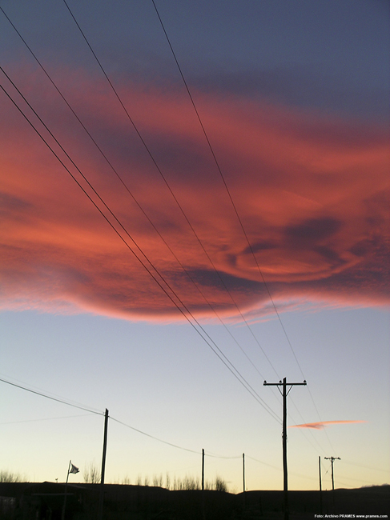

# Actúa: Empezar a buena hora (23 de 30)

La **hora  de inicio** de la actividad debe guardar relación con el **tiempo total para realizarla**, el tipo de grupo con el que se vaya y la **previsión meteorológica**.

No siempre es necesario madrugar mucho, pero con el objetivo de que un imprevisto no obligue a pasar la noche en la montaña debemos calcular que **entre el horario de regreso y la puesta del sol haya un mínimo de 4-5 horas de diferencia**.  

En verano y en montaña, suelen ser muy habituales las **tormentas de evolución**: aquéllas que se van formando con el calor a medida que pasan las horas y que en un momento dado descargan agua con importante aparato eléctrico. Si la previsión es de este tipo, conviene estar a resguardo para cuando empiece la tormenta, pues este tipo de tormentas pueden ser peligrosas por la posible caída de rayos.  

Madrugar también es bueno para **evitar estar en la montaña en las horas de más calor**.  

Como **federados** **debemos intentar iniciar la actividad en buena hora**.

