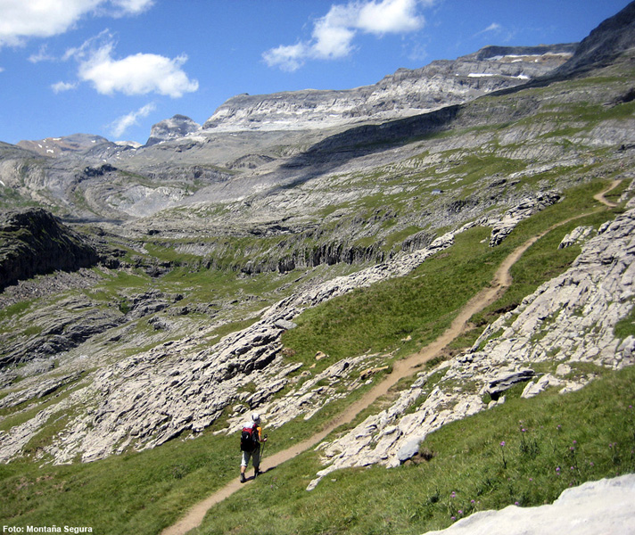

# **Actúa: No dejar a nadie solo (25 de 30)**

Dejar solo a alguien, o partir el grupo, suele ser el origen de problemas mayores. **Un número importante de los rescates se producen cuando un grupo se divide**, puesto que normalmente uno de esos dos subgrupos no es del todo autónomo y las decisiones que toma pueden acarrearle problemas.

Hay que poner especial atención en llevar al grupo de manera compacta en las siguientes situaciones:  

  
1\. Cuando se reduce la **visibilidad** por la niebla, la espesura de la vegetación, la lluvia o la escasez de luz  
2\. En los **tramos más peligrosos**, donde pueden producirse **caídas** (desniveles, cursos de agua...)  
3\. Con los **niños,** a los que hay que dedicar una especial atención

La mejor recomendación es **no dividir nunca el grupo**. Si no se puede evitar, deberá tomarse esta precaución básica:

*   **que en cada subgrupo haya gente capaz** de conducir al resto a destino

Igualmente, debe evitarse **dejar sola a una persona**. Retrasarse o quedar a la espera del retorno del grupo comporta también importantes peligros:

*   es muy habitual que la persona se canse de la espera y haga algo no acordado, como **regresar sola**, sin esperar al grupo
*   las posibilidades de caer en situaciones de **nerviosismo** y **desorientación** se multiplican

