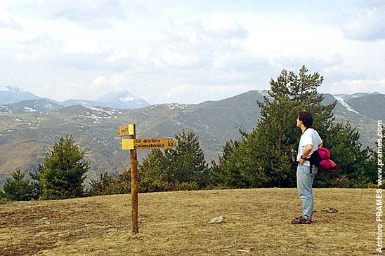

# Actúa: Tener en cuenta las alternativas (26 de 30)

Nunca debemos olvdiar que lo importante es disfrutar del día, y si no se puede hacer una actividad hoy ya se hará mañana.

Como **federados**, si el recorrido lo requiere (por ser una excursión de envergadura, porque nos parece que el grupo va muy justo en experiencia y capacidades como para afrontarla con seguridad, porque la meteo es muy inestable, etc...) habremos preparado un plan alternativo. Debemos recordar "usarlo" si las circunstancias sobre el terreno lo aconsejan.

#### Es aconsejable tener en cuenta que:  

**1.** Antes de tomar una decisión, debemos valorar los **itinerarios alternativos** y los **horarios de ida y de vuelta de todas las opciones**  
**2.** Ante la duda, conviene elegir siempre la **opción más corta** y/o **segura**  
**3\. Dar marcha atrás** no es ningún fracaso: deben hacerlo si piensan que es lo más razonable en ese momento  
**4.** Deben evaluar al **grupo** y si alguien no va bien, considerar las alternativas al objetivo inicial de la salida

Porque la realidad es que conforme avance el día:

**1.** Aumenta el **agotamiento** y, normalmente, disminuyen las **reservas de comida y agua**  
**2.** Se reducen las **horas de luz** y la **temperatura ambiente**  
**3.** Muchas pequeñas **dolencias** tienden a agravarse
