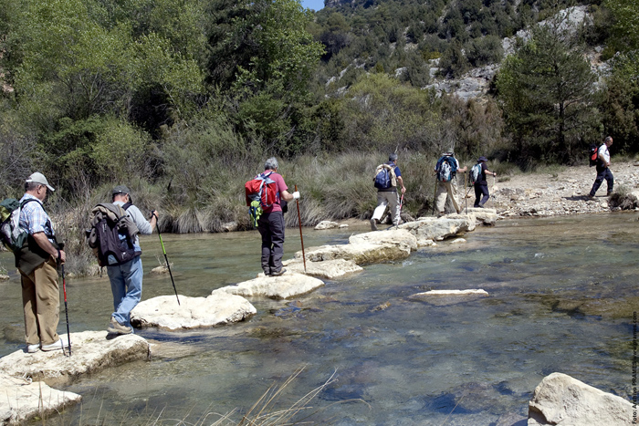

# Planifica: algunos factores a tener en cuenta para una correcta elección del itinerario (3 de 30)

Para una acertada elección del itinerario conviene como **federado tengas en cuenta**:  

1\. El**tipo de recorrido**que quieres hacer: montaña, paseo familiar, travesía de varios días...

2\. Tu  **experiencia**y el hábito en la práctica del senderismo

3\. La**edad**del resto del grupo

4\. La**forma física**y la**motivación** de todos

5\. Las **condiciones de la montaña** y la **previsión del tiempo** para esos días

