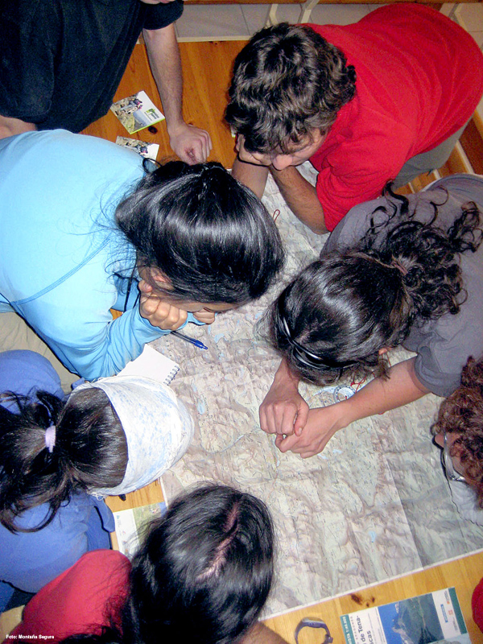

# Planifica: Hacer los cálculos (5 de 30)

Para **calcular los datos básicos de una excursión** como **federado** necesitarás:

**A. Mapade la zona**, cuanto más detallado y actualizado mejor (escala 1:25.000, 1:40.000).

**B.** Conocimientos básicos de**lectura de mapas**y de**orientación**en el medio  

**C.** Tener en cuenta las**variables**relacionadas con el tipo de firme y existencia de pasos de mayor dificultad, que no siempre vienen reseñados en los mapas  

Del mapa deberás extraer dos datos fundamentales que te permitirán calcular horarios previstos:  

**\- Distancia horizontal a recorrer  
**

**\- Desniveles positivos y negativos acumulados**  

Muy importante: hay quecalcular el**horario de ida**y el**horario de vuelta**... ¡salvo que pienses en quedarse a vivir en el lugar! No es una tontería, muchas veces se olvida y luego vienen problemas como un agotamiento imprevisto, la noche que se echa encima...

Además, te conviene recordar que la mayoría de los tiempos que dan las guías y folletos son **tiempos estimados sin paradas** (alrededor de un 30 % más puede ser una buena estimación si queremos calcular el tiempo con paradas).

Como **federado** no olvides nunca calcular **h****orarios intermedios de las rutas que vas a hacer**: ello te facilitará la toma de decisiones sobre el terreno, como darte la vuelta o elegir un itinerario alternativo más corto, si lo consideras oportuno.

