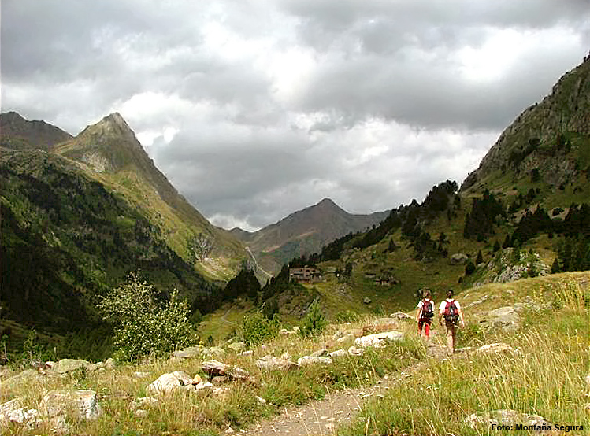

# Planifica: Consulta el tiempo (7 de 30)

Conocer la **previsión meteorológica** es fundamental para asegurar una buena excursión.

El **tiempo puede ser muy cambiante y variar mucho en el mismo día,** sobre todo en la montaña. Además, a partir de cierta altura y aunque sea verano, debemos prever siempre la posibilidad de lluvia y de descensos bruscos de la temperatura.

La web de la[**Agencia Estatal de Meteorología**](http://www.aemet.es/es/eltiempo/prediccion/montana)es una de las fuentes fiables para conocer la**previsión del tiempo**. En ellaencontrarás la predicción para **zonas de montaña**, que es la que contempla con mayor detalle sus particularidades.  

Como **federado**, no dudes en tener disponible esta Web en tu ordenador o su APP en el teléfono movil. Recuerda que **el parte se actualiza diariamente a las 18:00 horas**, por lo que ese será el momento ideal para consultarlo.  

El **tiempo previsto será importante para elegir el recorrido**, pero también para **elegir el equipo** que deberás llevar en la mochila.  
  

